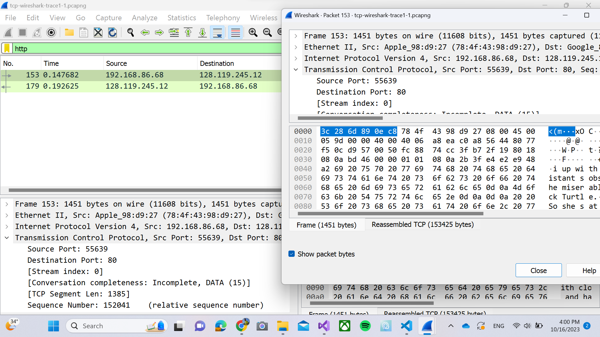
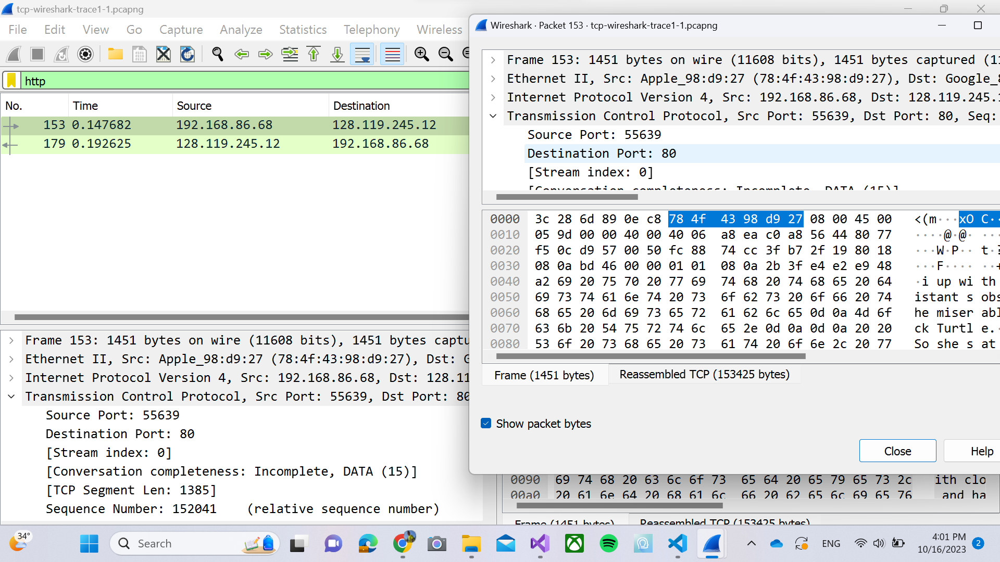
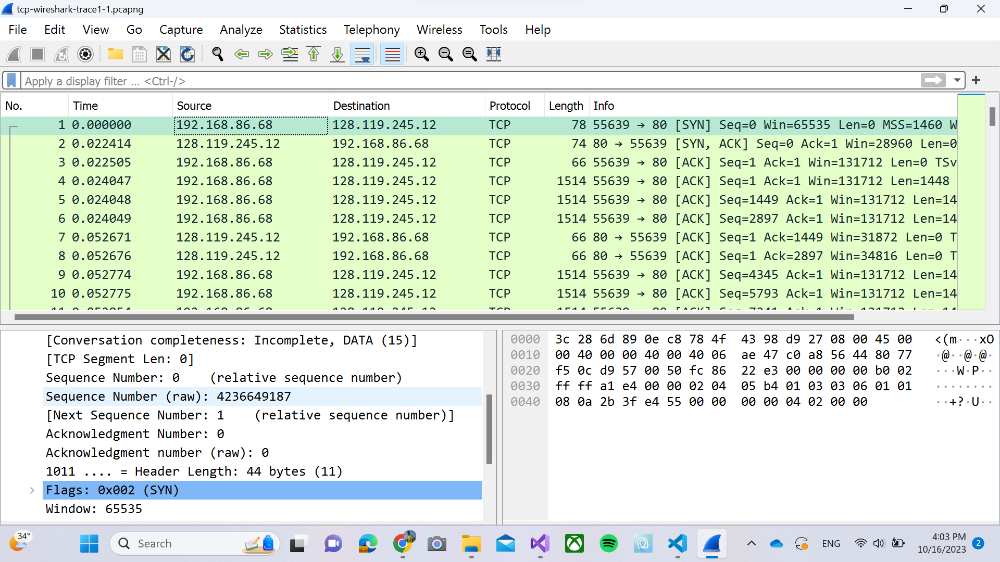
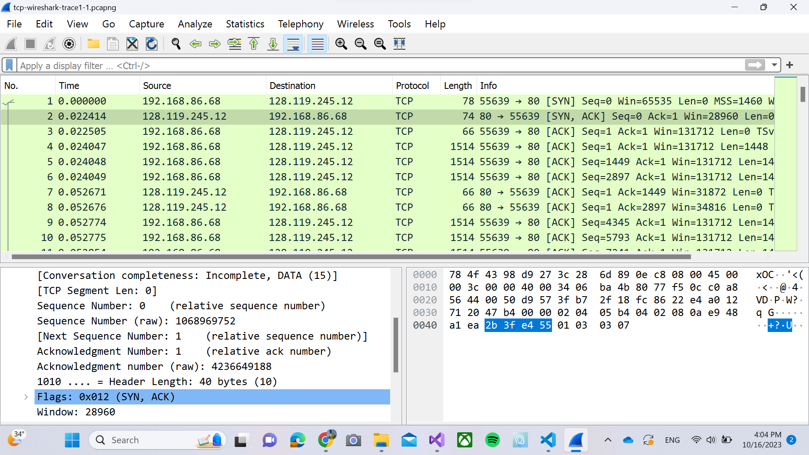

# Jarkom-Modul-Hands-On

Muhammad Rafi Sutrisno - 5025211167

## TCP

### 1. What is the IP address and TCP port number used by the client computer (source) that is transferring the alice.txt file to gaia.cs.umass.edu?

Source ip : 192.168.86.68
source port : 55639.

### 2. What is the IP address of gaia.cs.umass.edu? On what port number is it sending and receiving TCP segments for this connection?

Destination ip : 128.119.245.12
Destination port : 80.

### 3. What is the sequence number of the TCP SYN segment that is used to initiate the TCP connection between the client computer and gaia.cs.umass.edu? What is it in this TCP segment that identifies the segment as a SYN segment? Will the TCP receiver in this session be able to use Selective Acknowledgments?

Seq number untuk TCP SYN adalah 4236649187.
flags 0x002 (SYN) yang menandakan TCP ini sebagai SYN. seharusnya karena terdapat flags, maka bisa melakukan selective.

### 4. What is the sequence number of the SYNACK segment sent by gaia.cs.umass.edu to the client computer in reply to the SYN? What is it in the segment that identifies the segment as a SYNACK segment? What is the value of theAcknowledgement field in the SYNACK segment? How did gaia.cs.umass.edu determine that value?

Seq number di SYN ACK adalah 1068969752.
flag 0x012 (SYN, ACK), ack numbernya 1 dengan rawnya adalah 4236649188,yang merupakan seq number SYN +1.

### 5. What is the sequence number of the TCP segment containing the header of the HTTP POST command? How many bytes of data are contained in the payload (data) field of this TCP segment? Did all of the data in the transferred file alice.txt fit into this single segment?

Sequence number : 4236649188.
Payload : 1514 bytes, and No.

### 6. Consider the TCP segment containing the HTTP “POST” as the first segment in the data transfer part of the TCP connection.

time HTTP POST : 0.147682
time ACK pertama : 0.149626
rtt : 0.001944
rtt ack kedua : 0.000003
Estimated RTT : 0.1926

### 7.  What is the length (header plus payload) of each of the first four data-carrying TCP segments?

length totalnya : header 32 bytes + payload 1448 bytes = 1480 bytes

### 8.

### 9.

### 10.

## UDP

