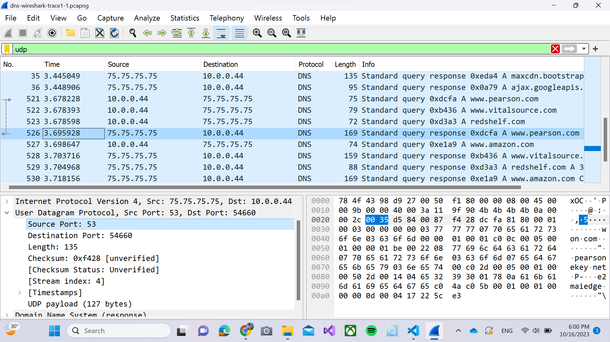

# Jarkom-Modul-Hands-On

Muhammad Rafi Sutrisno - 5025211167

# TCP

### 1. What is the IP address and TCP port number used by the client computer (source) that is transferring the alice.txt file to gaia.cs.umass.edu?

Source ip : 192.168.86.68
source port : 55639.

### 2. What is the IP address of gaia.cs.umass.edu? On what port number is it sending and receiving TCP segments for this connection?

Destination ip : 128.119.245.12
Destination port : 80.

### 3. What is the sequence number of the TCP SYN segment that is used to initiate the TCP connection between the client computer and gaia.cs.umass.edu? What is it in this TCP segment that identifies the segment as a SYN segment? Will the TCP receiver in this session be able to use Selective Acknowledgments?

Seq number untuk TCP SYN adalah 4236649187.
flags 0x002 (SYN) yang menandakan TCP ini sebagai SYN. seharusnya karena terdapat flags, maka bisa melakukan selective.

### 4. What is the sequence number of the SYNACK segment sent by gaia.cs.umass.edu to the client computer in reply to the SYN? What is it in the segment that identifies the segment as a SYNACK segment? What is the value of theAcknowledgement field in the SYNACK segment? How did gaia.cs.umass.edu determine that value?

Seq number di SYN ACK adalah 1068969752.
flag 0x012 (SYN, ACK), ack numbernya 1 dengan rawnya adalah 4236649188,yang merupakan seq number SYN +1.

### 5. What is the sequence number of the TCP segment containing the header of the HTTP POST command? How many bytes of data are contained in the payload (data) field of this TCP segment? Did all of the data in the transferred file alice.txt fit into this single segment?

Sequence number : 4236649188.
Payload : 1514 bytes, and No.

### 6. Consider the TCP segment containing the HTTP “POST” as the first segment in the data transfer part of the TCP connection.

time HTTP POST : 0.147682
time ACK pertama : 0.149626
rtt : 0.001944
rtt ack kedua : 0.000003
Estimated RTT : 0.1926

### 7.  What is the length (header plus payload) of each of the first four data-carrying TCP segments?

length totalnya : header 32 bytes + payload 1448 bytes = 1480 bytes

### 8.

### 9.

### 10.

# UDP

### 1. Select the first UDP segment in your trace. What is the packet number4 of this segment in the trace file? What type of application-layer payload or protocol message is being carried in this UDP segment? Look at the details of this packet in Wireshark. How many fields there are in the UDP header? (You shouldn’t look in the textbook! Answer these questions directly from what you observe in the packet trace.) What are the names of these fields? 

packet number : 5
protocol : SSDP
UDP header field : 4

### 2. By consulting the displayed information in Wireshark’s packet content field for this packet (or by consulting the textbook), what is the length (in bytes) of each of the UDP header fields?

Length of each UDP : 2 bytes x 4 = 8 bytes

### 3. The value in the Length field is the length of what? (You can consult the text for this answer). Verify your claim with your captured UDP packet. 

Length : 283

### 4. What is the maximum number of bytes that can be included in a UDP payload?

65527 bytes
The maximum number of bytes that can be included in a UDP payload is (2^16 – 1) bytes plus the header bytes. This gives 65535 bytes – 8 bytes = 65527 bytes.

### 5. What is the largest possible source port number?

65535
The largest possible source port number is (2^16 – 1) = 65535.

### 6. What is the protocol number for UDP? Give your answer in decimal notation. To answer this question, you’ll need to look into the Protocol field of the IP datagram containing this UDP segment (see Figure 4.13 in the text, and the discussion of IP header fields).

The IP protocol number for UDP is 0x11 hex, which is 17 in decimal value.

### 7. Examine the pair of UDP packets in which your host sends the first UDP packet and the second UDP packet is a reply to this first UDP packet. (Hint: for a second packet to be sent in response to a first packet, the sender of the first packet should be the destination of the second packet). What is the packet number of the first of these two UDP segments in the trace file? What is the packet number of the second of these two UDP segments in the trace file? Describe the relationship between the port numbers in the two packets. 

first packet : 521
second packet : 526

The source port of the UDP packet sent by the host is the same as the destination port of the
reply packet, and conversely the destination port of the UDP packet sent by the host is the same
as the source port of the reply packet.
